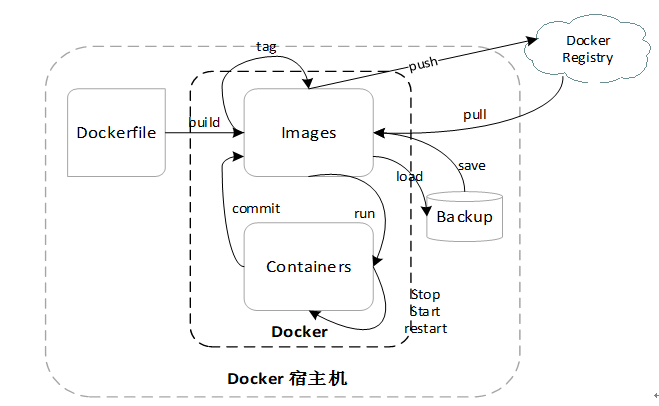

# docker 入门指北

@(docker)


[TOC]

## what is docker

1. docker 是一个用 golang 写的高性能 LXC 管理软件，可以跨平台 ( 非 linux 环境安装的 docker 运行在一个小型虚拟机中 )
2. docker 软件包含客户端和服务端 ( C / S )

> [Gary的影响力：为什么容器技术将主宰世界](https://blog.csdn.net/gaoyingju/article/details/49616295)
> [谢幺：一个“优雅”技术人眼中，容器与虚拟化的相爱相杀](https://www.leiphone.com/news/201612/4juGZ8u6ZYjZldOi.html)
> [Docker：Docker Engine Overview](https://docs.docker.com/engine/docker-overview/)
> [Docker：What is a Container](https://www.docker.com/resources/what-container)

## why docker

docker 解决了我什么问题：
1. 快速配置统一的开发环境
2. 几乎完美的资源隔离，且消耗小
3. CI CD 流水线所有环境都能一致，标准化镜像交付

> [知乎：Docker 的应用场景在哪里？](https://www.zhihu.com/question/22969309/answer/38317063)
> [什么是 Docker ？容器对应用程序的好处。](https://developer.ibm.com/cn/blog/2017/what-is-docker-containers/)
> [Docker五大优势：持续集成、版本控制、可移植性、隔离性和安全性](http://dockone.io/article/389)

## play with docker

> 如果你并不准备在自己的机器上安装 docker，可以在这里体验。
> https://labs.play-with-docker.com/

### 一、安装

1. linux 下安装 docker
 
方法一：官方 shell 脚本 https://get.docker.com/

 快速安装/更新最新稳定版：
```bash
$ curl -fsSL get.docker.com -o get-docker.sh
$ sh get-docker.sh
```

方法二：参考官方文档
https://docs.docker.com/install/linux/docker-ce/centos/

2. Mac 下安装 docker

直接下载 `.dmg` 安装包
https://store.docker.com/editions/community/docker-ce-desktop-mac

3. Windows 下安装 docker

没试过，请自行参考文档
https://docs.docker.com/docker-for-windows/install/

### 二、基础使用

> Docker 命令结构图
> 

- 名词解释

1. Dockerfile 用于构建镜像的描述文件，描述镜像构建的每个过程
2. image 镜像，用于创建容器或作为基础镜像构建新的镜像。
3. container 容器，从镜像创建，或保存为新的镜像
4. backup 镜像备份 tarball
5. registry 镜像仓库，如 dockerhub

- 举个简单的例子

第一步，创建一个 `Dockerfile` 文件，写入以下内容
```dockerfile
FROM alpine:3.8
CMD echo "Hello Dockerfile. Hello world."
```

第二步，保存 Dockerfile 后构建镜像
```bash
$ docker build /path/to/dockerfile/dir -t hello-world
```

终端会输出构建过程，构建成功后默认打上 latest 标签
```plain
Sending build context to Docker daemon  2.048kB
Step 1/2 : FROM alpine:3.8
 ---> 196d12cf6ab1
Step 2/2 : CMD echo "Hello Dockerfile. Hello world."
 ---> Running in 922679fa2740
Removing intermediate container 922679fa2740
 ---> 4718680a5e3c
Successfully built 4718680a5e3c
Successfully tagged hello-world:latest
```

第三步，使用该镜像运行一个容器
```bash
$ docker run hello-world
# 会输出以下内容，然后容器退出
Hello Dockerfile. Hello world.
```

容器状态以应用前台状态为依据，不想让该容器退出，可以这样
```bash
# -t 给容器分配一个 tty
# sh 为容器启动命令，覆盖了 Dockerfile CMD
$ docker run -t hello-world sh
```

```bash
# 如果要让容器后台运行，添加 -d 参数
$ docker run -dt hello-world sh
```

```bash
# 可以通过 docker <子命令> --help 大法查看具体使用说明
$ docker run --help
```

push 镜像到 dockerhub
```bash
# 登录到 dockerhub
$ docker login
# 登录成功后 ~/.docker/config.json 文件中会有 auth 信息
```

```bash
# push 要求镜像命名 username/imageName:tag
$ docker image tag hello-world:latest username/hello-world:latest
$ docker push username/hello-world:latest
```

会用 `help` 大法后，命令结构图中的其他基础操作就由大家自行探索啦。

- 常用命令

> TIPS: docker run 是旧版 docker cli 的用法，新版推荐 docker container run，更富有语义及 restful 风格。

1. docker container 对容器的操作
2. docker image 对镜像的操作
3. docker network 对网络的操作
4. docker volume 对存储卷的操作

其他命令多数都为上面四个命令的子命令，如
```bash
# 对容器的某些操作
$ docker container inspect
$ docker container rm
$ docker container ls

# 同样的，对镜像也行
$ docker image inspect
$ docker image rm
$ docker image ls

# 当然，对网络也是阔以滴
$ docker network inspect
$ docker network rm
$ docker network ls
```

---

> Reference documentation: https://docs.docker.com/reference/
